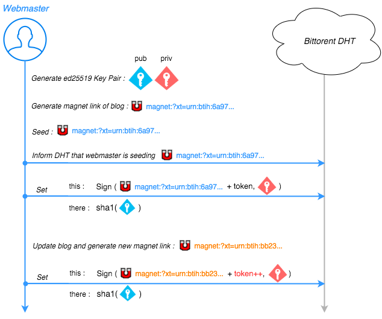

# Chunks Server

Chunks presents a decentralised way to distribute content. The content is generated by a webmaster, and spread out to the interested peers in a decentralised way via bittorrent and its DHT.

It's roughly doing this :

A quick summary would be :

 * Generate ed25519 keypair
 * Generate magnet Link from what's inside ./blog
 * Increment flag and send everything on the DHT
 * Seed

### Install

`npm install .`

`node genKp.js` to generate the keypair

Put stuff in ./blog

`node postLatest.js freshlyGeneratedKey.priv` to post stuff on DHT and seed.

### Todo

Check errors when unlocking private key !

### Further work

[More stuff on chunks-gui's readme](https://github.com/pldubouilh/chunks-gui)
